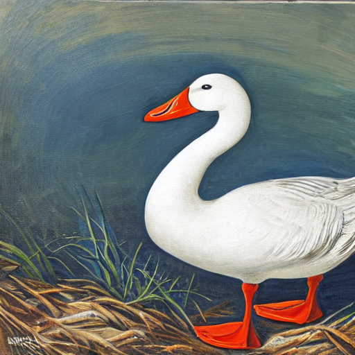
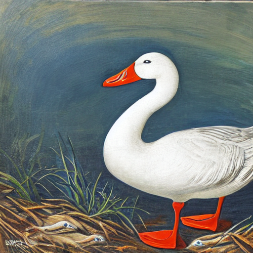

# Steps to use weight-only quantization

STEP 1. Download TensorRT-OSS and TensorRT Model Optimizer.

```shell
git clone https://github.com/georgeliu95/TensorRT.git -b woq
git clone https://github.com/georgeliu95/TensorRT-Model-Optimizer.git
```

STEP 2. Run calibration for WoQ.

```shell
cd modelopt/diffusers
python quantize.py --model runwayml/stable-diffusion-v1-5 --format int8 --batch-size 4 --calib-size 512 --woq --n_steps 30 --exp_name sd15.woq
```

STEP 3. Export to ONNX model.

```shell
python run_export.py --model runwayml/stable-diffusion-v1-5 --quantized-ckpt ./unet.state_dict.sd15.woq.pt --format int8 --woq --onnx-dir sd15.woq.onnx
```

STEP 4. Run script to convert weights from FP16 to INT8 in ONNX model.

```shell
python convert_weight.py --onnx=sd15.woq.onnx/unet.onnx
```

STEP 5. Place the W8 WoQ ONNX model under path `/path/to/onnx-woq/unet.opt/`. Then run demo/Diffusion in FP16 as baseline.

```shell
cd </path/to/TensorRT/demo/Diffusion>
python3 demo_txt2img.py "A white goose holding a paint brush" --negative-prompt "normal quality, low quality, worst quality, low res, blurry, nsfw, nude" --denoising-steps 30 --seed 2946901 --onnx-dir onnx --engine-dir engine --output-dir output 
```



STEP 6. Run demo/Diffusion with weight-stripped engine of WoQ model.

```shell
python3 demo_txt2img.py "A white goose holding a paint brush" --negative-prompt "normal quality, low quality, worst quality, low res, blurry, nsfw, nude" --denoising-steps 30 --seed 2946901 --int8-woq-weightless --onnx-dir onnx-woq --engine-dir engine-woq --output-dir output-woq
```



## Benchmark on RTX 3090

||Baseline|WoQ|
|:--:|:--:|:--:|
|CLIP time (ms)|2.04|2.06|
|UNet x 30 time (ms)|747.38|742.48|
|VAE-Dec time (ms)|35.79|35.91|
|Pipeline time (ms)|785.33|780.57|
|ONNX model size (MB)|1641|961 (w8) => 1641(w16), quant 2.0|
|TRT engine size (MB)|1658|25 (weight-stripped)|
|GPU runtime memory (MiB)|4890|4998|
|Time of App (s)|14.699|32.481 (including refitting weight-stripped engine)|
